# VQ-VAE A Posteriori with Geodesic Quantization

Deep Learning and Applied AI project - Sapienza.

This project revisits the VQ-VAE pipeline by introducing a **post-hoc quantization approach** that leverages geodesic distances in the learned latent manifold. Then compare reconstruction quality, sample fidelity, and perplexity against standard end-to-end **VQ-VAE** on MNIST and CelebA datasets.

Checkpoints and other .pt files could not be included due to github file size limit (100 mb).

UV and wandb were very useful tools in this project.

## Pipeline scripts (example for CelebA).

Run scripts as modules:

VAE + Geodesic Quantization training, latent extraction, post hoc geodesic quantization:

    uv run -m src.vq_vae_geodesic.scripts_celeba.train_vae_celeba
    uv run -m src.vq_vae_geodesic.scripts_celeba.extract_celeba_latents
    uv run -m src.vq_vae_geodesic.scripts_celeba.quantize_celeba

VQ-VAE training and codes extraction:

    uv run -m src.vq_vae_geodesic.scripts_celeba.train_vqvae_celeba
    uv run -m src.vq_vae_geodesic.scripts_celeba.extract_vqvae_codes_celeba (for pixelCNN prior)

Evaluate reconstructions and metrics for VAE, VAE + Geodesic, and VQ-VAE:

    uv run -m src.vq_vae_geodesic.scripts_celeba.evaluate_recon_celeba

Interpolation comparison between VAE + Geodesic and VQ-VAE:

    uv run -m src.vq_vae_geodesic.scripts_celeba.interpolate_latent_codes_celeba

VAE + Geodesic Quantization + PixelCNN Prior training and sampling:

    uv run -m src.vq_vae_geodesic.scripts_celeba.train_pixelcnn_geodesic_celeba

    uv run -m src.vq_vae_geodesic.scripts_celeba.sample_geodesic_pixelcnn_celeba
    uv run -m src.vq_vae_geodesic.scripts_celeba.compare_geodesic_sampling_celeba
    uv run -m src.vq_vae_geodesic.scripts_celeba.compare_vae_vs_geodesic_celeba
    uv run -m src.vq_vae_geodesic.scripts_celeba.compare_geodesic_temperatures_celeba

VQ-VAE + PixelCNN Prior on CelebA training and sampling:

    uv run -m src.vq_vae_geodesic.scripts_celeba.train_pixelcnn_vqvae_celeba

    uv run -m src.vq_vae_geodesic.scripts_celeba.compare_vqvae_sampling_celeba

Evaluate pixelCNN for VAE + Geodesic and VQ-VAE:

    uv run -m src.vq_vae_geodesic.scripts_celeba.evaluate_pixelcnn_celeba

## Visual Results

### MNIST

#### Reconstruction Comparison
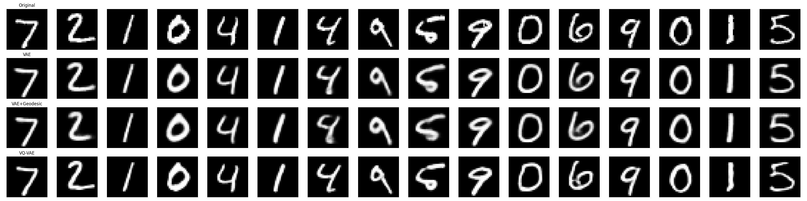
*Top to bottom: Original, VAE, VAE+Geodesic, VQ-VAE*

#### Geodesic Quantization - PixelCNN Sampling
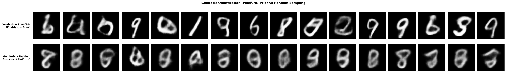
*PixelCNN samples (top) vs random codes (bottom) - Geodesic quantization*

#### Geodesic PixelCNN Samples
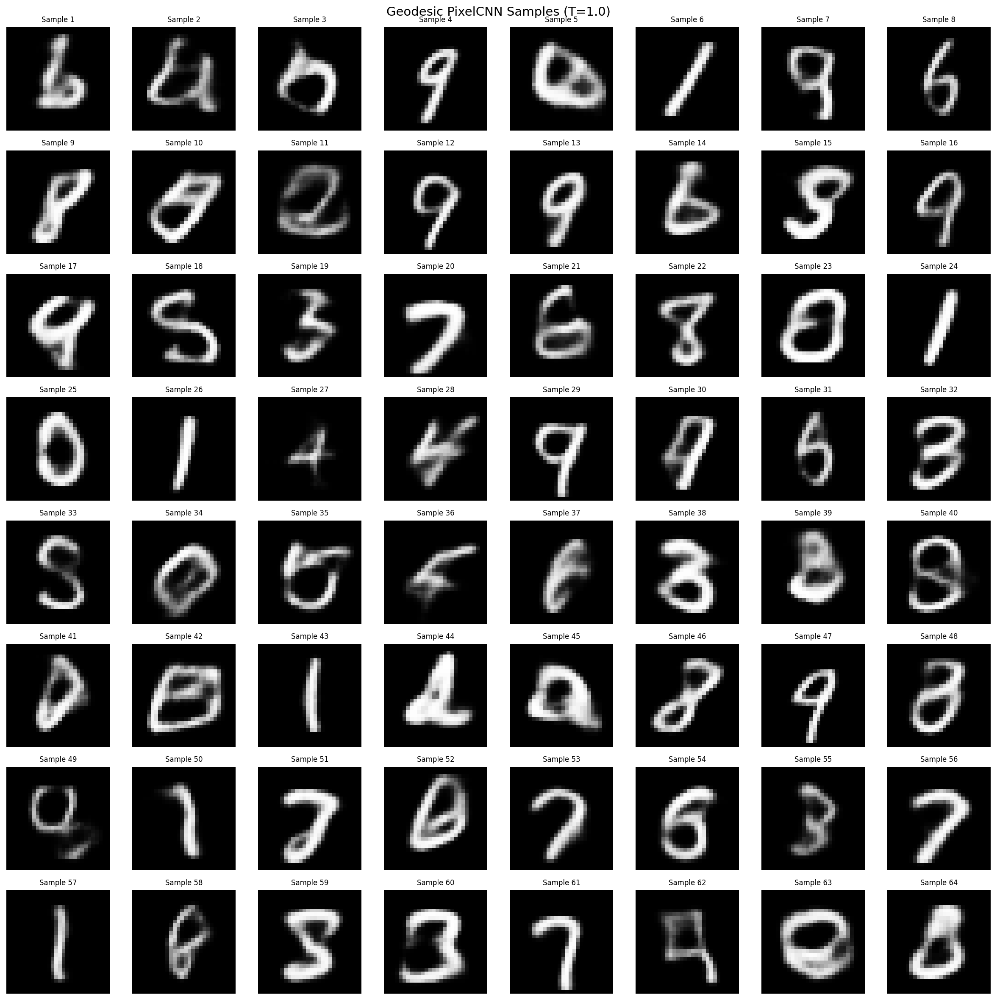

*Geodesic PixelCNN samples*

#### Geodesic Quantization - Temperature Comparison
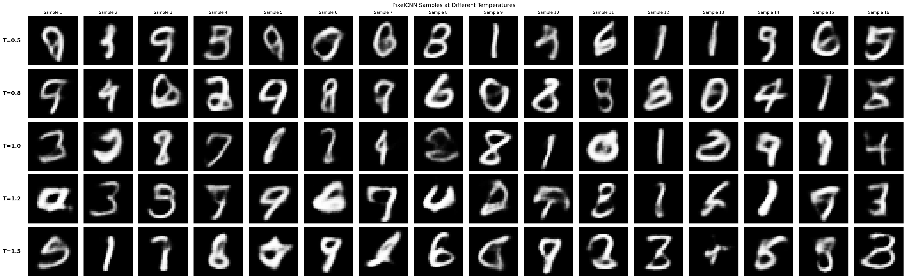
*Effect of temperature on sample diversity*

#### VQ-VAE - PixelCNN Sampling
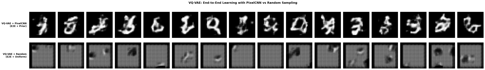
*PixelCNN samples (top) vs random codes (bottom) - VQ-VAE*

#### Latent Space Interpolations
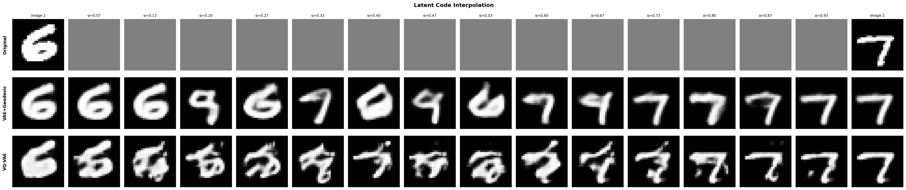
*Top to bottom: Original images, VAE+Geodesic (quantized latents), VQ-VAE. Each row shows smooth interpolation between two random samples.*

---

### CelebA

#### Reconstruction Comparison
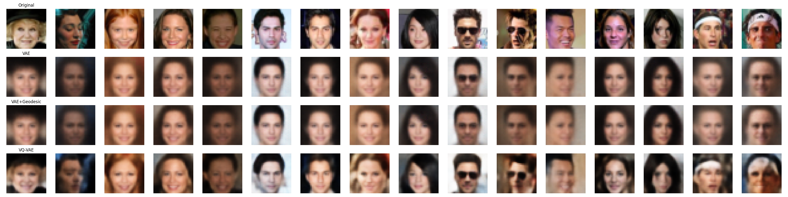
*Top to bottom: Original, VAE, VAE+Geodesic, VQ-VAE*

#### Geodesic Quantization - PixelCNN Sampling
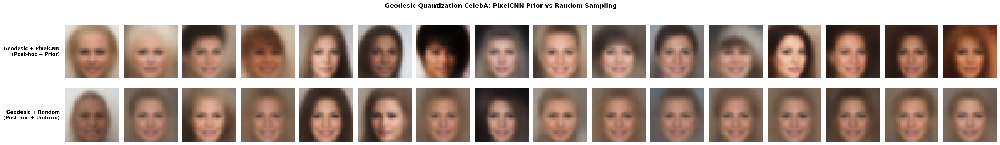
*PixelCNN samples (top) vs random codes (bottom) - Geodesic quantization*

#### Geodesic PixelCNN Samples
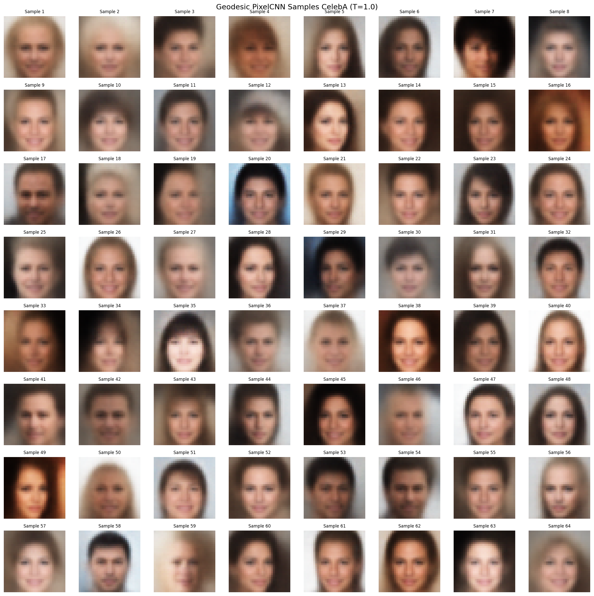

*Geodesic PixelCNN samples*

#### Geodesic Quantization - Temperature Comparison
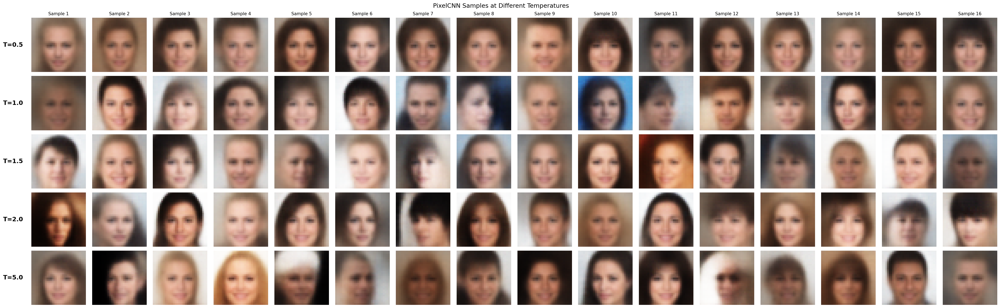
*Effect of temperature on sample diversity*

#### VQ-VAE - PixelCNN Sampling
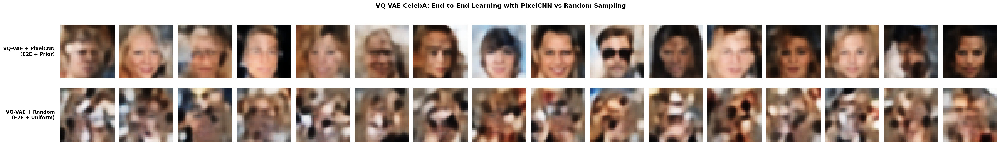
*PixelCNN samples (top) vs random codes (bottom) - VQ-VAE*

#### Latent Space Interpolations
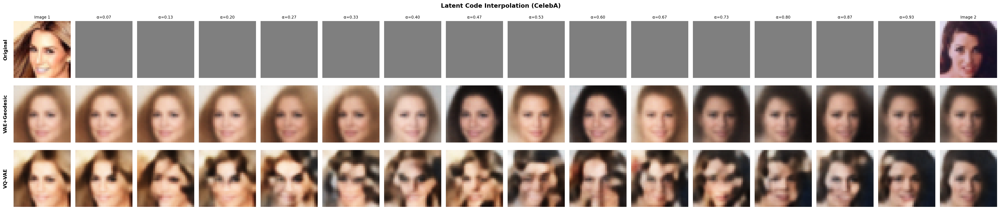
*Top to bottom: Original images, VAE+Geodesic (quantized latents), VQ-VAE. Each row shows smooth interpolation between two random face samples.*

---

### CIFAR-10 with beta vae (b=0.1) 
Just for testing... not included in the report because of blurry results

#### Reconstruction Comparison
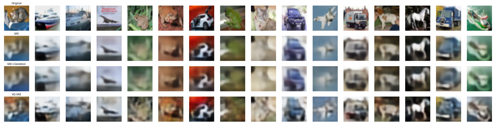
*Top to bottom: Original, VAE, VAE+Geodesic, VQ-VAE*

#### Geodesic Quantization - PixelCNN Sampling
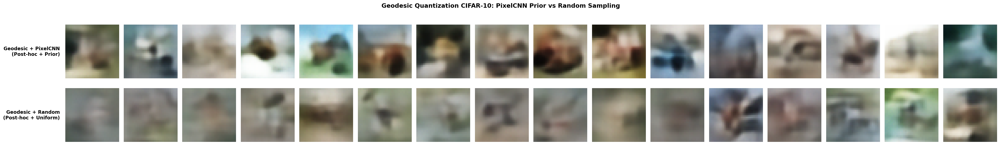
*PixelCNN samples (top) vs random codes (bottom) - Geodesic quantization*

#### Geodesic PixelCNN Samples
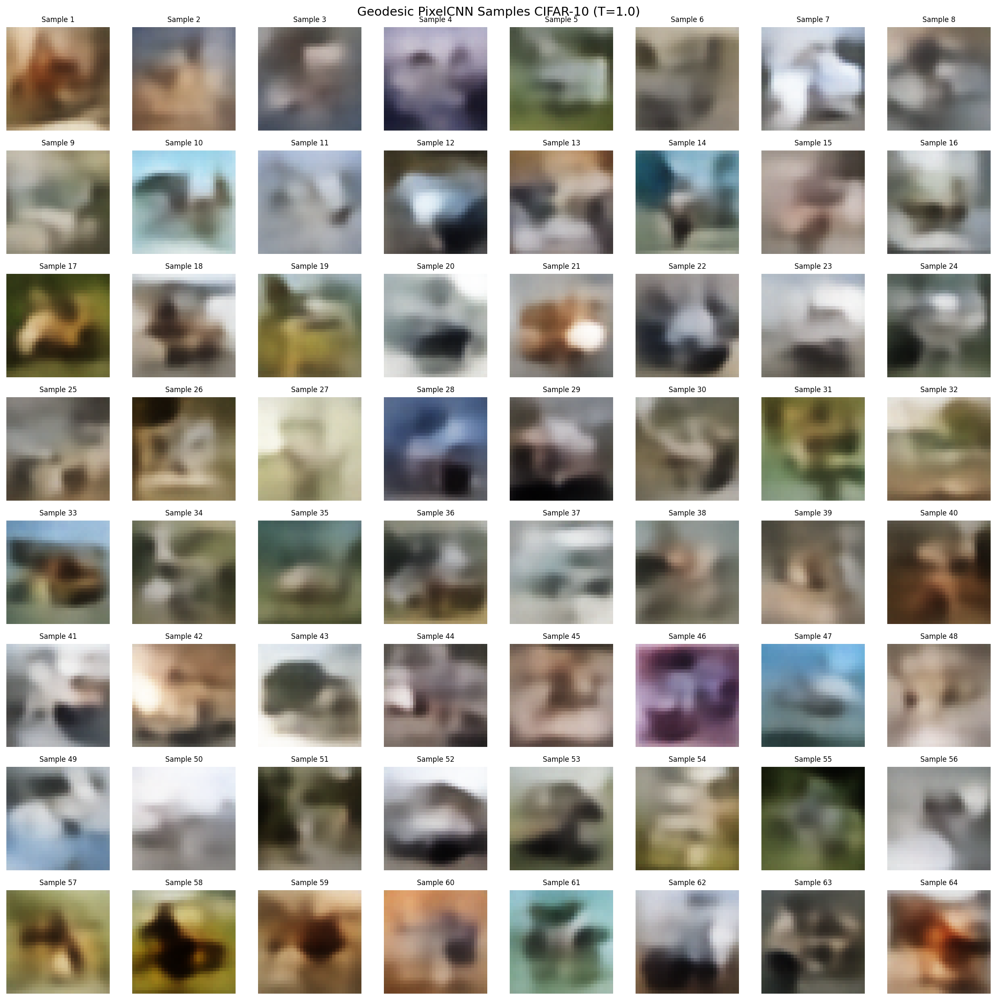

*Geodesic PixelCNN samples*

#### Geodesic Quantization - Temperature Comparison
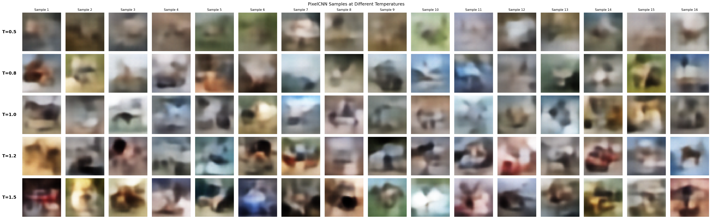
*Effect of temperature on sample diversity*

#### VQ-VAE - PixelCNN Sampling
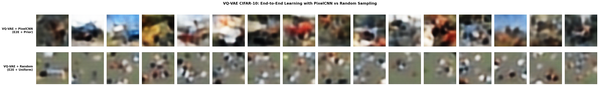
*PixelCNN samples (top) vs random codes (bottom) - VQ-VAE*

#### Latent Space Interpolations
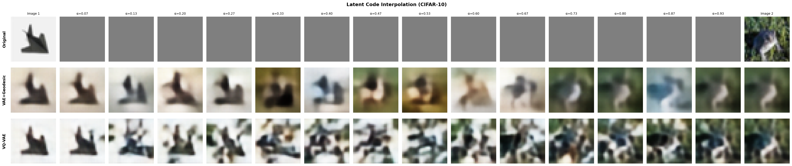
*Top to bottom: Original images, VAE+Geodesic (quantized latents), VQ-VAE. Each row shows smooth interpolation between two random samples.*

