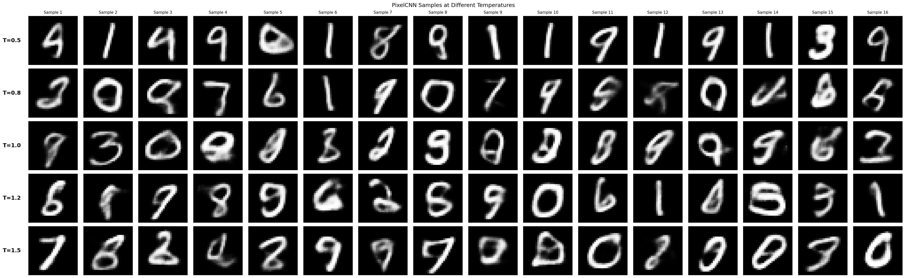
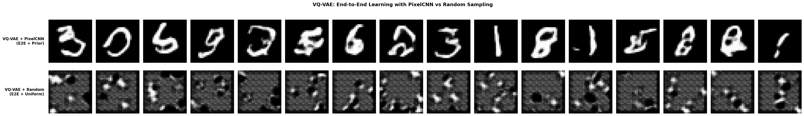
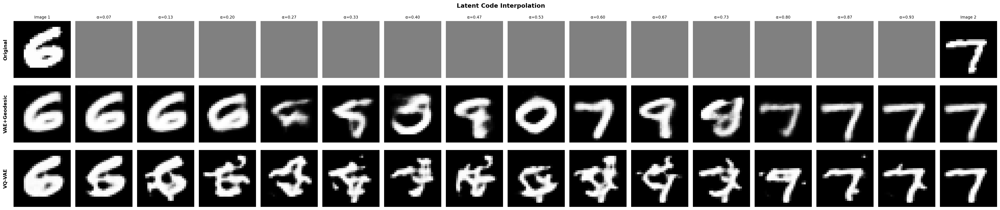
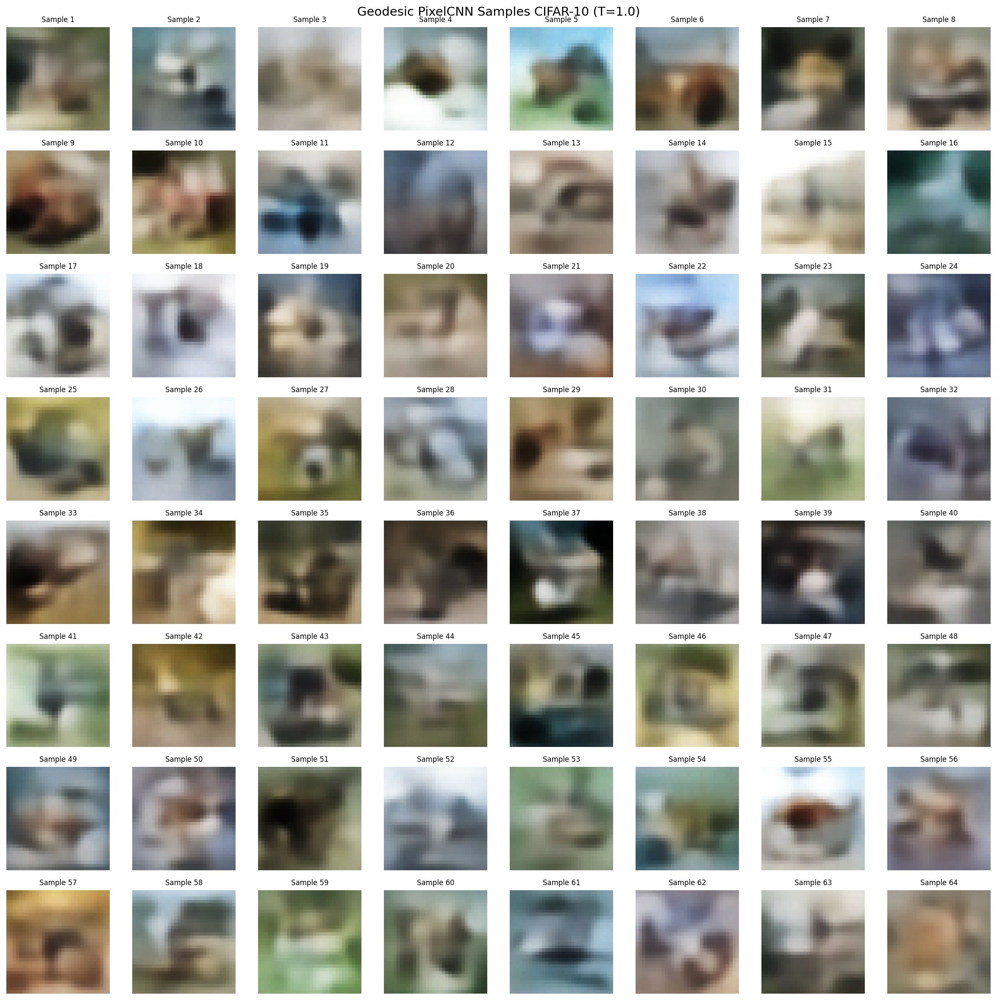
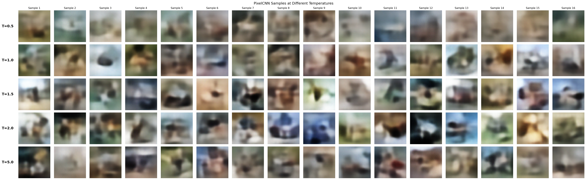
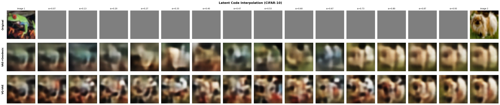

# VQ-VAE A Posteriori with Geodesic Quantization

Deep Learning and Applied AI project - Sapienza.

This project revisits the VQ-VAE pipeline by introducing a **post-hoc quantization approach** that leverages geodesic distances in the learned latent manifold. Then compare reconstruction quality, sample fidelity, and codebook utilization against standard end-to-end **VQ-VAE** on MNIST and CelebA datasets.

Checkpoints and other .pt files could not be included due to github file size limit (100 mb).

UV and wandb were very useful tools in this project.

## Visual Results

### MNIST

#### Reconstruction Comparison

*Top to bottom: Original, VAE, VAE+Geodesic, VQ-VAE*

#### Geodesic Quantization - PixelCNN Sampling

*PixelCNN samples (top) vs random codes (bottom) - Geodesic quantization*

#### Geodesic PixelCNN Samples

*Geodesic PixelCNN samples*

#### Geodesic Quantization - Temperature Comparison

*Effect of temperature on sample diversity*

#### VQ-VAE - PixelCNN Sampling

*PixelCNN samples (top) vs random codes (bottom) - VQ-VAE*

#### Latent Space Interpolations

*Top to bottom: Original images, VAE+Geodesic (quantized latents), VQ-VAE. Each row shows smooth interpolation between two random samples.*

---

### CelebA

#### Reconstruction Comparison

*Top to bottom: Original, VAE, VAE+Geodesic, VQ-VAE*

#### Geodesic Quantization - PixelCNN Sampling

*PixelCNN samples (top) vs random codes (bottom) - Geodesic quantization*

#### Geodesic PixelCNN Samples

*Geodesic PixelCNN samples*

#### Geodesic Quantization - Temperature Comparison

*Effect of temperature on sample diversity*

#### VQ-VAE - PixelCNN Sampling

*PixelCNN samples (top) vs random codes (bottom) - VQ-VAE*

#### Latent Space Interpolations

*Top to bottom: Original images, VAE+Geodesic (quantized latents), VQ-VAE. Each row shows smooth interpolation between two random face samples.*

---

### CIFAR-10 with beta vae (b=0.1) 
Just for testing... not included in the report because of blurry results

#### Reconstruction Comparison

*Top to bottom: Original, VAE, VAE+Geodesic, VQ-VAE*

#### Geodesic Quantization - PixelCNN Sampling

*PixelCNN samples (top) vs random codes (bottom) - Geodesic quantization*

#### Geodesic PixelCNN Samples

*Geodesic PixelCNN samples*

#### Geodesic Quantization - Temperature Comparison

*Effect of temperature on sample diversity*

#### VQ-VAE - PixelCNN Sampling

*PixelCNN samples (top) vs random codes (bottom) - VQ-VAE*

#### Latent Space Interpolations

*Top to bottom: Original images, VAE+Geodesic (quantized latents), VQ-VAE. Each row shows smooth interpolation between two random samples.*

