# VQ-VAE with Geodesic Quantization

> **A posteriori vector quantization using geodesic distances in learned latent spaces**

[](https://www.python.org/downloads/)
[](https://pytorch.org/)
[](https://opensource.org/licenses/MIT)

## 📖 Overview

This project revisits the classic VQ-VAE pipeline with a novel twist: instead of jointly learning a discrete latent space, we first train a standard continuous VAE, then perform **a posteriori vector quantization using geodesic distances** (Wasserstein-2) in the latent space, rather than Euclidean ones.

### Key Innovation

Traditional VQ-VAE learns a discrete codebook end-to-end using Euclidean (L2) distance. Our approach:

1. ✅ Train a standard VAE to learn a continuous latent space
2. ✅ Apply K-means clustering with **Wasserstein-2 geodesic distance** 
3. ✅ Build discrete codebook respecting latent manifold geometry
4. ✅ Train PixelCNN autoregressive prior over discrete codes
5. ✅ Compare with traditional end-to-end VQ-VAE

**Why Geodesic?** The Wasserstein-2 metric respects the curvature and uncertainty (μ, σ) of the learned latent manifold, providing geometrically more meaningful quantization than simple Euclidean distance.

## 🎯 Results Highlights

| Metric | VAE + Geodesic | VQ-VAE | Winner |
|--------|----------------|--------|--------|
| **Reconstruction MSE** | 0.0136 | **0.0024** | VQ-VAE (471% better) |
| **Codebook Utilization** | **100%** (256/256) | 85% (218/256) | Geodesic |
| **Dead Codes** | **0** | 38 | Geodesic |
| **Training** | Multi-stage | End-to-end | Different approaches |

**Key Finding**: Geodesic quantization achieves perfect codebook coverage but sacrifices reconstruction quality. The trade-off between geometric fidelity and reconstruction is fundamental to post-hoc vs joint optimization.

## 🏗️ Architecture

### VAE + Geodesic Quantization (Our Approach)

```mermaid
graph LR
    A[Input Image] --> B[VAE Encoder]
    B --> C[μ, logvar]
    C --> D[Geodesic K-Means]
    D --> E[Discrete Codes]
    E --> F[Codebook Lookup]
    F --> G[VAE Decoder]
    G --> H[Reconstruction]
    
    E --> I[PixelCNN Prior]
    I --> J[New Codes]
    J --> F
```



### VQ-VAE Baseline (End-to-End)


## 🚀 Quick Start

### Installation

```bash
# Clone repository
git clone https://github.com/michelegranatiero/VQ_VAE_Geodesic.git
cd VQ_VAE_Geodesic

# Install dependencies (using uv)
uv sync
```

### Training Pipeline

#### 1. Train VAE (Continuous Latent Space)
```bash
uv run -m vq_vae_geodesic.scripts.train_vae_mnist
```

#### 2. Extract Latents & Apply Geodesic Quantization
```bash
# Extract latent representations (μ, logvar) from trained VAE
uv run -m vq_vae_geodesic.scripts.extract_mnist_latents

# Perform K-means clustering with Wasserstein-2 distance
uv run -m vq_vae_geodesic.scripts.quantize_mnist
```

#### 3. Train PixelCNN Autoregressive Prior
```bash
uv run -m vq_vae_geodesic.scripts.train_pixelcnn_mnist
```

#### 4. Train VQ-VAE Baseline (for comparison)
```bash
uv run -m vq_vae_geodesic.scripts.train_vqvae_mnist
```

### Evaluation & Comparison

```bash
# Compare reconstruction quality
uv run -m vq_vae_geodesic.scripts.compare_vae_vs_vqvae

# Compare generation methods (with/without PixelCNN)
uv run -m vq_vae_geodesic.scripts.compare_sampling_methods

# Compare PixelCNN prior vs random sampling
uv run -m vq_vae_geodesic.scripts.compare_pixelcnn_vs_random
```

## 📊 Visualizations

### Reconstruction Comparison


*Top to bottom: Original images, VAE+Geodesic reconstructions, VQ-VAE reconstructions*

### Sampling Methods


*Three approaches: VQ-VAE random, Geodesic+PixelCNN (best), Geodesic random*

### Prior Impact


*Top: PixelCNN learned prior (realistic), Bottom: Random uniform (noisy)*

## 📁 Project Structure

```
VQ_VAE_Geodesic/
├── src/vq_vae_geodesic/
│   ├── models/
│   │   ├── modules/
│   │   │   ├── vae.py              # VAE (encoder→μ,logvar→decoder)
│   │   │   ├── vqvae.py            # VQ-VAE (encoder→VQ→decoder)
│   │   │   ├── encoder.py          # Encoder architectures
│   │   │   ├── decoder.py          # Decoder architectures
│   │   │   └── pixelCNN.py         # Autoregressive prior
│   │   └── quantization/
│   │       └── geodesic.py         # Geodesic quantizer (Wasserstein-2)
│   ├── scripts/
│   │   ├── train_*.py              # Training scripts
│   │   ├── compare_*.py            # Comparison scripts
│   │   └── quantize_mnist.py       # Geodesic quantization
│   ├── training/
│   │   └── train.py                # Training loops
│   └── evaluation/
│       ├── evaluate.py             # Metrics
│       └── sample.py               # Sampling utilities
├── data/
│   ├── checkpoints/                # Saved models
│   ├── latents/                    # Extracted latents & codebook
│   └── recons/                     # Visualizations
├── RESULTS_SUMMARY.md              # Detailed results & analysis
└── README.md                       # This file
```

## 🔬 Technical Details

### Geodesic Distance (Wasserstein-2)

Instead of Euclidean L2 distance:
```python
d_euclidean(z1, z2) = ||μ1 - μ2||²
```

We use Wasserstein-2 distance that considers both mean and variance:
```python
d_wasserstein(z1, z2) = ||μ1 - μ2||² + ||σ1 - σ2||²
```

This respects the probabilistic nature of the VAE latent space and the geometry of the learned manifold.

### Architecture Equivalence

Both VAE and VQ-VAE now use **equivalent architectures** for fair comparison:

**Encoder**: `Conv(1→128) → Conv(128→256) → Projection`
- VAE: Projects to 32-dim flat vector (μ, logvar)
- VQ-VAE: Projects to 4-dim spatial map (7x7)

**Decoder**: `Projection → ConvT(256→128) → ConvT(128→1)`
- VAE: Takes 32-dim flat vector
- VQ-VAE: Takes 4-dim spatial map (7x7)

**Parameters**: ~1M for both models

### Codebook Configuration

- **Size**: 256 codewords (K=256)
- **Dimension**: 4 per chunk (embedding_dim=4)
- **Grid**: 2x4 = 8 chunks per image
- **Total latent**: 32 dimensions (8 chunks x 4 dim)

## 📚 Key Insights

### ✅ Advantages of Geodesic Quantization

1. **Perfect Codebook Coverage**: 100% utilization vs 85% for VQ-VAE
2. **No Dead Codes**: All 256 codewords are used
3. **Geometric Awareness**: Respects latent manifold curvature
4. **Modularity**: Easy to experiment with different components
5. **Interpretability**: Clear separation of concerns

### ❌ Limitations

1. **Reconstruction Quality**: 471% worse MSE than VQ-VAE
2. **Multi-Stage Training**: More complex pipeline
3. **Computational Cost**: Wasserstein distance expensive
4. **No Joint Optimization**: Cannot fine-tune encoder/decoder for codes

### 🎯 When to Use

**Use Geodesic Quantization** if:
- Codebook coverage is critical
- Latent geometry matters for downstream tasks
- Modularity and interpretability are important

**Use Standard VQ-VAE** if:
- Reconstruction quality is primary metric
- Training simplicity is important
- End-to-end optimization is beneficial

## 📖 References

1. van den Oord et al., "Neural Discrete Representation Learning" (VQ-VAE), NeurIPS 2017
2. Kingma & Welling, "Auto-Encoding Variational Bayes" (VAE), ICLR 2014
3. van den Oord et al., "Pixel Recurrent Neural Networks" (PixelCNN), ICML 2016
4. Optimal Transport theory for Wasserstein distances

## 🎓 Academic Context

This is a university project for a Deep Learning course, exploring the impact of non-Euclidean geometry in learned latent spaces. The goal is to understand trade-offs between:
- Post-hoc vs joint optimization
- Geometric fidelity vs reconstruction quality
- Modular vs end-to-end learning

## 📝 License

MIT License - see LICENSE file for details

## 👤 Author

**Michele Granatiero**
- GitHub: [@michelegranatiero](https://github.com/michelegranatiero)
- Course: Deep Learning (University Project)

## 🙏 Acknowledgments

- Course instructors for project guidance
- PyTorch team for deep learning framework
- WandB for experiment tracking

---

For detailed results and analysis, see [RESULTS_SUMMARY.md](RESULTS_SUMMARY.md)
